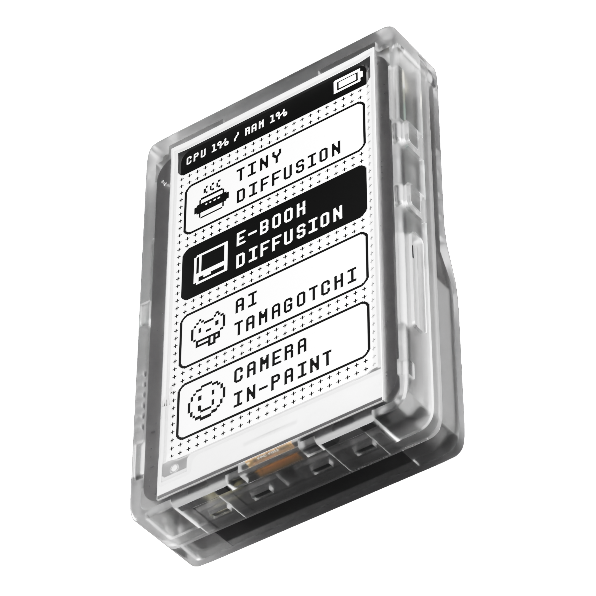

First of all, we appreciate your support for the PamirAI Team. ❤️❤️❤️

We are a small team of three, and this is an ongoing project with fast iterations. If our instructions are not up-to-date or clear enough, feel free to ask in our [Discord Channel](https://discord.com/invite/Q8vQqd6Gdx).

## Device Check and Preparation

After receiving your device, please ensure it is not damaged. If you find any issues, please message us as soon as possible via Discord.

If your device is shipped with a battery (you can visibly check through the back of the casing), please charge it via a USB-C cable for **at least 15 minutes** before use, and remain plugged in for the duration. If your device is not shipped with a battery, you can still use Distiller One with a USB-C cable attached.

## Power-On

> **To power on the device, press and hold the left button for 2 seconds.**

The screen should turn on with a Distiller One Title and an anime girl gif. If the display appears to be getting darker and darker, this is normal during the power-up sequence. If nothing happens, please contact us via Discord.

After less than 8 seconds, your device should boot up with a menu screen similar to the one above.

## Navigation

You can navigate the main menu screen using the up and down buttons on the right side. If you find the buttons hard to press or register, please allow a few days for the material to soften.

Press the left button to select and enter a program.

## Wi-Fi Setup

Select the Wi-Fi app and press the left button to enter.

Use the up and down buttons to navigate the networks found by the device, and enter the password via the UI.

Once the device is connected to the Wi-Fi network, the app will exit automatically. Upon success, a Wi-Fi logo will appear on the top right of the toolbar.

We are working to incorporate touch screen and QR code scanning functionality to speed up text-based input in the near future.

## Exit Program and Power-Off

To exit the current application and return to the main menu, do the following:

> **Press and hold the up button on the right, then immediately press and hold the select button on the left for 3 seconds, and let go of both buttons when the screen starts flashing.**

You should then see the exit menu. Use the up and down buttons on the right to navigate and select your action to return or shut down.

## Force Shutdown

Avoid doing this unless the normal power-off method does not work. To force shutdown, do the following:

> **Press and hold the up button on the right, then immediately press and hold the select button on the left for 8 seconds, and let go when the status indicator light (Red LED on the top of the case) is off.**

## LED Indicator

There are a total of three red LEDs on the Distiller One. Here are the meanings of these LEDs:

- (Provide specific details about each LED indicator)

## Battery and Charging

Distiller One is compatible with a 3.7V 3000mAh 974058 Rechargeable Lithium Polymer Battery. If your device does not come with a battery due to shipping restrictions, you can purchase one from [Amazon](https://www.amazon.com/dp/B09YQ393N2?psc=1) at your own risk.

<Info>
WARNING: If you purchase the battery from the link above, **you need to manually reverse the polarity of the connector!** Failure to do so may brick the device and cause a significant fire hazard. If you are unsure how to do this, please wait until we release a device-compatible battery or contact us via Discord.
</Info>

For the Founders Edition or hardware version 0.6 or above [(How To Check)](/Onboarding#check-hardware-version), your battery connector will be different from the one offered on Amazon. Please contact us on Discord for battery instructions.

### Battery Care

Please treat the battery with extreme care, avoid direct sunlight exposure, and avoid compression. Do not leave the battery charging for prolonged periods (over 10 hours).

### Battery Indicator

For Hardware Version 0.5 or below [(How To Check)](/Onboarding#check-hardware-version), unfortunately, your device cannot check battery percentage. You can use the battery indicator to tell whether it is charging or not.

### Battery Life

The battery life of our device varies depending on usage. Our estimated battery life is 2 hours with continuous 100% CPU usage.

## Casing and Care

<Info>  
Due to the nature of the material, please treat this device delicately. Avoid pushing too hard on the side buttons. Avoid dropping the device from any height.
</Info>

Each case is printed with FormLab's SLA printer and later hand-sanded to a smooth finish. If you are unhappy with the surface finish, you can sand it down with 800-grit sandpaper or higher with running water. We are working hard to produce injection-molded parts that use better material and produce more durable and better-finished parts.

In the rare case of the case cracking under normal use, please contact us via Discord.

Please ensure the device is not exposed to direct sunlight for prolonged periods, as the casing, e-ink, and battery are sensitive to heat.

## Check Hardware Version

You can check your PCB version by removing the SoM (System on a Module, i.e., the green board). The version number is located under the SoM on the black PCB.

## Usage Notice

- **Distiller One is a Dev-Kit** and has not been approved by any regulatory agency such as the FCC. It is not for critical applications. We do not provide any warranty at this stage. If you encounter any issues with your device, please join our [Discord Channel](https://discord.com/invite/Q8vQqd6Gdx). 
- If you received a unit (excluding the Founder's Edition) prior to version V0.6, it is very sensitive to electrostatic discharge. While this is unlikely to cause permanent damage to the device, it may affect its performance temporarily.
- The on-board passive heat sink is not sufficient for continuous heavy usage and will throttle at 65°C. If you wish to change the throttle limit, please use an active heat sink. For more information regarding thermal management, please refer to the Thermal Section below.

## Additional Material

To learn your Distiller One Hardware better, please checkout our [Hardware & Firware Overview Page](/hardware_overview).