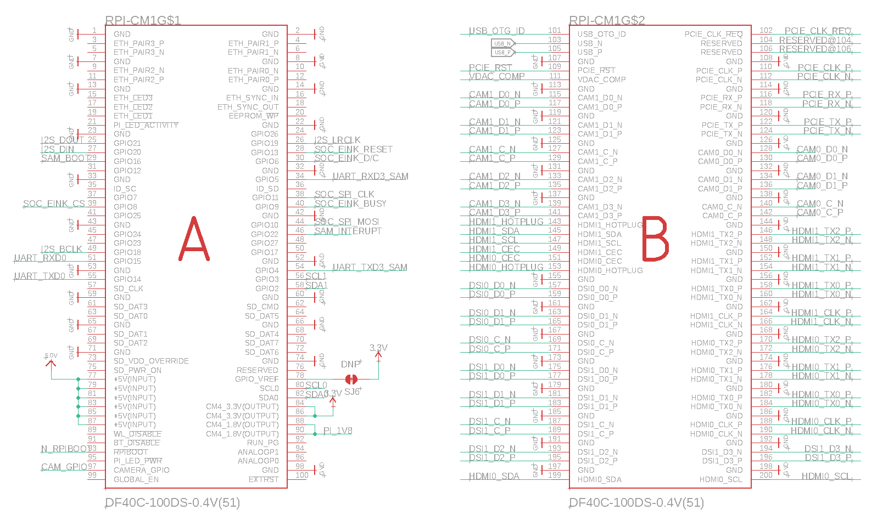
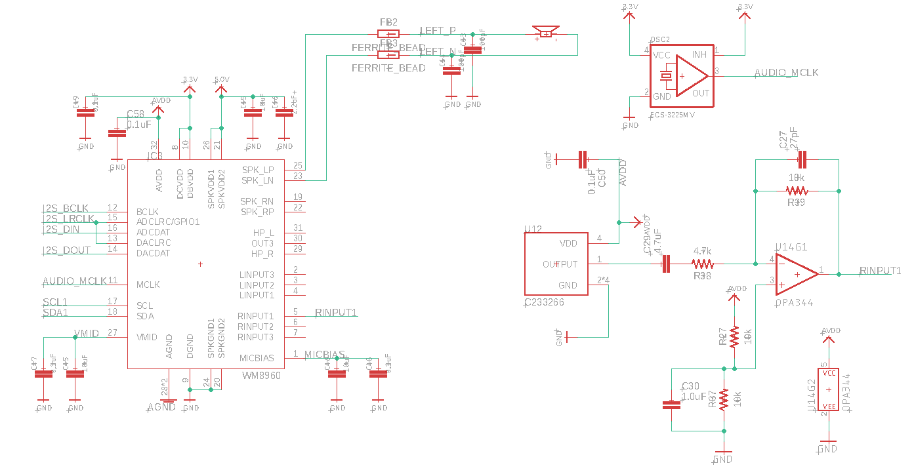
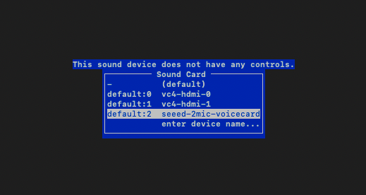
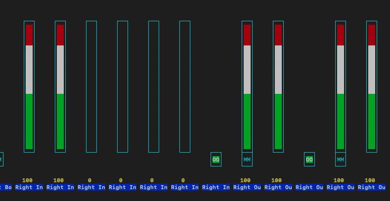
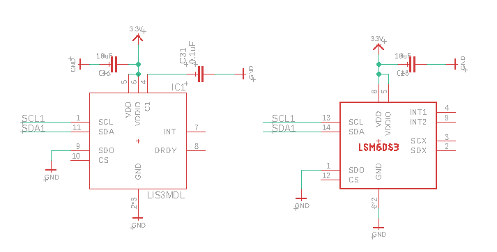
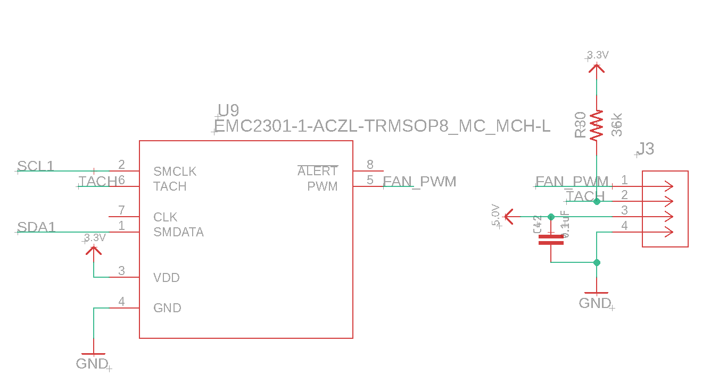
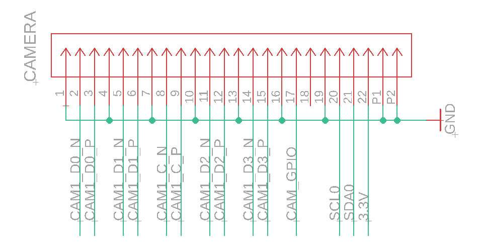
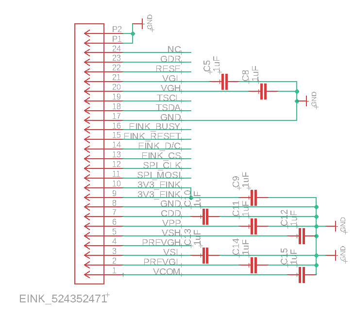

<Info>
    **If you wish to develop software on Distiller One, please read this document thoroughly at least once. It will save you hours of debugging.**
</Info>


### Overview

The system diagram provides an overarching view of the entire hardware architecture of Distiller One. Each subsystem is interconnected through various communication protocols and interfaces.


The system diagram above reflects the latest design of version 0.6.

The Distiller One contains a modular SoM (System on a Module) and a SAM (Signal Aggregation Module). In most scenarios, your development will be on the SoM, which is a Linux computer. On the other hand, the SAM module is an RP2040 microcontroller running our firmware. It handles user input such as button presses and provides the correct power-up and power-down sequences for the SoM. It is also used to monitor device health information such as thermal and battery status.

## Subsystem Breakdown

### 1. **System on Module (SoM)**



The SoM acts as the central processing unit of the device, interfacing with various peripherals and subsystems. All Distiller One units are currently shipped with the Raspberry Pi Compute Module 4.

To learn more about the Raspberry Pi Compute Module 4, please visit [here](https://datasheets.raspberrypi.com/cm4/cm4-datasheet.pdf).

**Interfaces**
  * I2C & I2S to the audio codec (WM8960)
  * I2C to sensors (LSM6DS3, LIS3MDL)
  * SPI to e-Ink Display 
  * PCIe to M.2 Key M module (Note that Distiller One does not supply power via PCIe)
  * MIPI-DPHY to camera module
  * UART0 is used for SoM debugging, and UART3 is used to communicate between the SAM and SoM
  * USB 2.0 to flash eMMC onboard SoM
  * GPIO to buttons and other control signals

### 2. **Audio Subsystem**



#### [WM8960](https://community.nxp.com/pwmxy87654/attachments/pwmxy87654/imx-processors/52419/1/WM8960.pdf) Audio Codec
  - Connected to SoM via I2C & I2S.
  - Interfaces with microphone (Mic) and microphone amplifier (Mic Amp).
  - Output to the speaker.
  - I2C Address: ```0x34H```

The WM8960 is a low power, high quality stereo codec designed for portable digital audio applications. It integrates a variety of features to enhance audio performance and reduce external component requirements. Key features include:

- **Stereo Class D Speaker Drivers**: Capable of providing 1W per channel into 8Ω loads with a 5V supply, offering high efficiency (87% at 1W output) and low distortion.
- **Headphone Driver**: We did not implement Headphone jack. However, it can delivers 40mW output power into 16Ω at 3.3V, supporting capless mode with low distortion and high SNR (90dB with 16Ω load).
- **Microphone Interface**: Includes a pseudo-differential configuration for high noise immunity, integrated low noise MICBIAS, and programmable automatic level control (ALC) and noise gate. On our Board, we included a op-amp circuit to boost input signal, as well as filtering capacitors to filter out low frequency noise.

#### Linux Audio Drivers for WM8960
You distiller will have the driver for WM8960 pre-installed. It should work out of the box. However, if you choice to re-flash the SoM, you might need to reinstall the audio drivers. Here is how.

After ssh into your SoM, check your Linux Version

```
uname -r
```

You will see result simular to bellow

```
6.6.20+rpt-rpi-v8
```

The 6.6 in this case is the linux version. Then proceed to clone the driver

```
cd ~
git clone https://github.com/HinTak/seeed-voicecard
cd seeed-voicecard
```

Use the version number found above, type the follow command, replace the version number bellow.

```
git checkout v{Linux Version Number}
```

Install using the command bellow.

```
sudo ./install.sh
sudo reboot
```


#### Volume Settings
In case you have issue with speaker volume, microphone input, please do the following to correct volume settings.

```
sudo alsamixer
```

Then **F6** to switch to **seeed-voicecard** , now you can change speaker output level. 

You will then see the following interface.


Please use your arrow key to select sound card number 2, then press enter.



Next, for Microphone, using left and right arrow key to turn **Right In** Channel to a volume that you desire. Usually a gain of 0 db (The lowest setting) should be suffcient. If you turn the gain setting too high, your might not able to hear anything. 

For Speaker, turn **Right Out** Channel to a volume that you desire. Again, If you turn the gain setting too high, you might not able to hear anything.

Once done, save the setting by runnig

```
alsactl --file ~/.config/asound.state store
```

Note : We have alsactl restore baked in /etc/rc.local so your change will get picked up after reboot.

To check your speaker and microphone, use the following command.

**Microphone Test**

```
sudo arecord -D hw:2,0 -f S32_LE -r 16000 -c 2 test.wav
```

**Speaker Test**

```
wget https://download.samplelib.com/wav/sample-15s.wav
sudo aplay -Dhw:2 sample-15s.wav
```


  
### 3. **Sensor Subsystem**


#### **LSM6DS3 (3-Axis Gyro + Accelerometer)**
  - Only on Founders Edition
  - Connected to SoM via I2C.
  - I2C Address: ```0x6A```
  - As of 2024/06/04, we have not implement drivers for this IC


#### **LIS3MDL (Magnetic Sensor)**
  - Only on Founders Edition
  - Connected to SoM via I2C.
  - I2C Address: ```0x1C```
  - As of 2024/06/04, we have not implement drivers for this IC

  
### 4. **Thermal Subsystem**



On-board passive heat-sink is not suffcient for continues heavy ussage and will throttle at 65C. If you desire to change the throttle limit, please buy an active heat-sink. You can purchase one [here](https://www.amazon.com/Waveshare-Dedicated-Cooling-Raspberry-Compute/dp/B0924L5YSD/r). Please note that the connector on this active heat-sink require replacement to be compatible with our device. You also would not able to close the back lid of the case with this heat-sink on. We are working on a active heat-sink that will work with our case and board. Please leave a comment in Discord if you need guidance.


#### EMC2301-1 Fan Controller
  - Connected to SoM via I2C.
  - Controls fan via a dedicated connector.
  - I2C Address: ```0x2E```

#### Fan Speed Control

##### Enabling I2C and the EMC2301 Fan Controller
    Open the terminal on your Raspberry Pi.
    Use `nano` to edit the `/boot/config.txt` file:
     ```sh
     sudo nano /boot/config.txt
     ```
    Add the following lines to enable the I2C bus and the EMC2301 fan controller:
     ```txt
     # Enable I2C.
     dtparam=i2c_arm=on
     dtparam=i2c_vc=on
     
     # Enable the EMC2301 fan controller.
     dtoverlay=i2c-fan,emc2301,i2c_csi_dsi
     ```
    Save the changes (`CTRL+X`, then `Y`, and `ENTER`) and reboot your Raspberry Pi:
     ```sh
     sudo reboot
     ```

##### Verifying the Fan Controller

    Ensure that the `i2c-tools` package is installed:
     ```sh
     sudo apt-get install -y i2c-tools
     ```

    Use `i2cdetect` to verify that the EMC2301 is recognized on the I2C bus:
     ```sh
     i2cdetect -y 10
     ```
    You should see `0x2f` or `0x2E` in the output, indicating the presence of the fan controller.

##### Controlling Fan Speed Manually

    Use `i2cset` to turn off the fan:
     ```sh
     i2cset -y 10 0x2f 0x30 0x00
     ```

    Set the fan to maximum speed:
     ```sh
     i2cset -y 10 0x2f 0x30 0xff
     ```

    Set the fan speed to a value between 0% (0x00) and 100% (0xFF):
     ```sh
     i2cset -y 10 0x2f 0x30 0x64  # Example: 0x64 sets the fan to approximately 40% speed
     ```

##### Using Automatic Fan Speed Control

    Follow these steps to install the open-source fan driver `cm4io-fan`:
     ```sh
     sudo apt install raspberrypi-kernel-headers
     sudo apt install dkms
     wget https://github.com/neg2led/cm4io-fan/archive/refs/tags/0.1.1.tar.gz
     sudo tar -xzvf 0.1.1.tar.gz -C /usr/src/
     sudo dkms install cm4io-fan/0.1.1
     ```

    Add a line to the `/boot/config.txt` file to configure the fan speed settings:
     ```txt
     dtoverlay=cm4io-fan,minrpm=1000,maxrpm=3000
     ```
    This configuration sets the fan to stay on at a minimum of 1000 RPM and a maximum of 3000 RPM when the temperature reaches 55°C.

    Save the changes and reboot your Raspberry Pi:
     ```sh
     sudo reboot
     ```

    Check the current fan speed with the following command:
     ```sh
     cat /sys/class/hwmon/hwmon2/fan1_input
     ```


#### Change Thermal Throttle Limit on SoM

<Info>
**Warning**: Please make sure you have an active heatsink on OR with the back-lid off before raising the throttle limit.
</Info>

The thermal throttle limit on a SoM determines the temperature at which the CPU will throttle its performance to prevent overheating. By default, this limit is set to 65C. However, if you have adequate cooling in place, you may choose to raise this limit to allow for higher performance.

   - To change the thermal throttle limit, you need to edit the `/boot/firmware/config.txt` file. This file contains various configuration settings for your SoM.
   - You can access and edit this file by using a text editor. For this guide, we'll use `nano`, a simple command-line text editor.

   - Access your SoM via SSH or directly through a connected monitor and keyboard.
   - Open the terminal.

   - Type the following command to open the configuration file in `nano`:
     ```sh
     sudo nano /boot/firmware/config.txt
     ```
   - Scroll down to find a section where you can add or modify the thermal limit settings.
   - Change the following lines to raise the thermal throttle limit. Replace `temp_limit` with your desired maximum temperature (in degrees Celsius). For example, to set the throttle limit to 80°C:
     ```txt
     # Set the thermal throttle limit to 80 degrees Celsius
     temp_limit=80
     ```

   - After adding the necessary lines, save the changes by pressing `CTRL+X`, then `Y` to confirm, and `ENTER` to exit the editor.
 
   - For the changes to take effect, you need to reboot your SoM. Type the following command and press `ENTER`:
     ```sh
     sudo reboot
     ```
   - After the SoM has rebooted, you can verify that the changes have been applied by checking the current thermal throttle limit. You can use the following command to check the current temperature:
     ```sh
     vcgencmd measure_temp
     ```
   - Ensure that your SoM operates within safe temperature ranges to prevent overheating and potential damage.

### 5. **Camera Subsystem**


**Camera Module**
  - Connected to SoM via MIPI-DPHY and I2C.
  - You can use any Camera Module on the market that compatible with Raspberry Pi Zero
  - Camera Driver should be installed on your device


### 6. **E-Ink Display Subsystem**



#### E-Ink Display Descriptions
  - 3.7-inch Active Matrix Electrophoretic Display (AM EPD)
  - Connected to SoM via SPI.
  - Both SoM and SAM Interfaces with E-Ink display using the same SPI Lane, with Tri-State buffer in between.
  - SoM's controll to the E-Ink Display will be turned off by SAM when SoC is shutdown.

#### Hardware Characteristics
- **Display Resolution**: 240(H) × 416(V) pixels, with a pixel density of 130 DPI.
- **Display Area**: 47.04(H) × 81.54(V) mm.
- **Ultra-Low Power Consumption**: The display operates in a pure reflective mode and consumes very low power, making it ideal for battery-operated devices.

#### Electrical Characteristics

- **Logic Supply Voltage (VCI)**: 2.4V to 3.6V.
- **Core Logic Voltage (VDD)**: Internally regulated from VCI.
- **Operating Temperature Range (TOPR)**: 0°C to +50°C.
- **Storage Temperature Range (TSTG)**: -25°C to +70°C.
- **Optimal Storage Conditions**:
  - Temperature: 23±2°C.
  - Humidity: 55±10% RH.

#### Thermal Limits and Device Constraints

- **Maximum Ratings**:
  - **Logic Input Voltage (VIN)**: -0.3V to VCI + 0.3V.
  - **Logic Output Voltage (VOUT)**: -0.3V to VCI + 0.3V.
- **Thermal Performance**:
  - Currently, our device can cause E-Ink display to over heat, we are working on addressing this issue. Please avoid long duration of direct sunlight and higher than 25C ambient environment.


**E-Ink Drivers**

Eink Driver is included in our SDK. For more information, please checkout the code base.

### 7. **Power Management Subsystem**
> This section is work in progress ...

**Battery Management**
  - **BQ27441 (Battery Monitor)**
    - Connected to SAM via I2C.
  - **BQ24075 (Power Path & Charger)**
    - Manages power input from USB-C and battery connection.
  - **MOSFETs for Power Switching**
    - Controls power distribution to SoM and E-Ink display.
  
### 8. **Haptic Feedback Subsystem**
> This section is work in progress ...

**DRV2605 (Haptic Motor Driver)**
  - Included in Founders Edition Only
  - Connected to SAM via I2C.
  - Interfaces with haptic motor.
